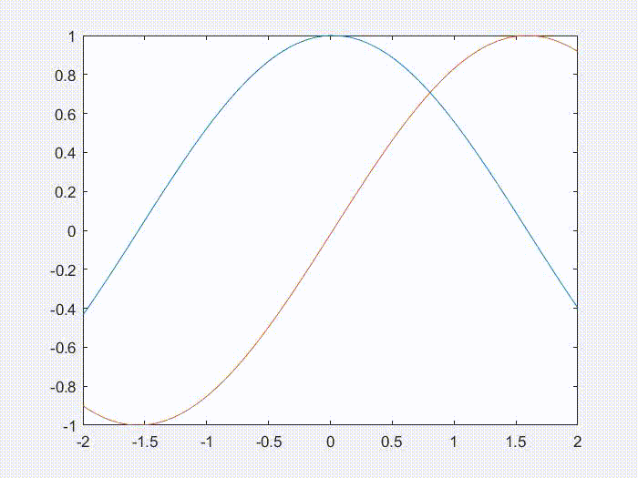
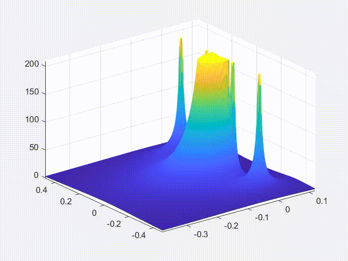

# matlab
## animateSinCos.m
Von dem Matlab Support bereitgestelltes Beispiel für eine effizente Erstellung einer Annimation. Annimation wird erstellt durch ändern der YData des Plottes anstatt einen neuen Plot zu kreieren. Eigens wurde das Speichern hinzugefügt.  

## EP2_Transmittanz.m 
animateSinCos.m Angewendet auf eine Physik Aufgabe.  

## teilchen_sim
Enthält eine Reihe an Matlab Dateien bei welcher ani.m ,unter Verwendung der Anderen, eine Simulation von geladen Teilchen animiert.(Sehr ineffizente Erstellung. Jedes mal wird ein neuer Plot erzeugt)  

## animateExample.m
Von dem Matlab Support bereitgestelltes Beispiel. Es wird in eine vorher evaluierte Funktion herreingezoomt. (zur Zeit zu komplex und irrelevant)  

## Gaussverfahren_LaTex
Erzeugt eine reduzierte Zeilenstufenmatrix mit zwischenschritten und LaTeX Code  

